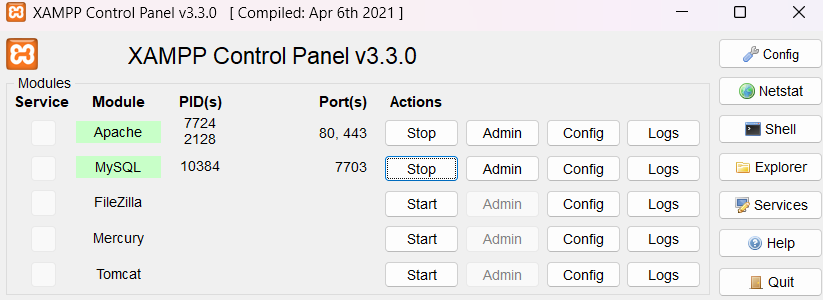
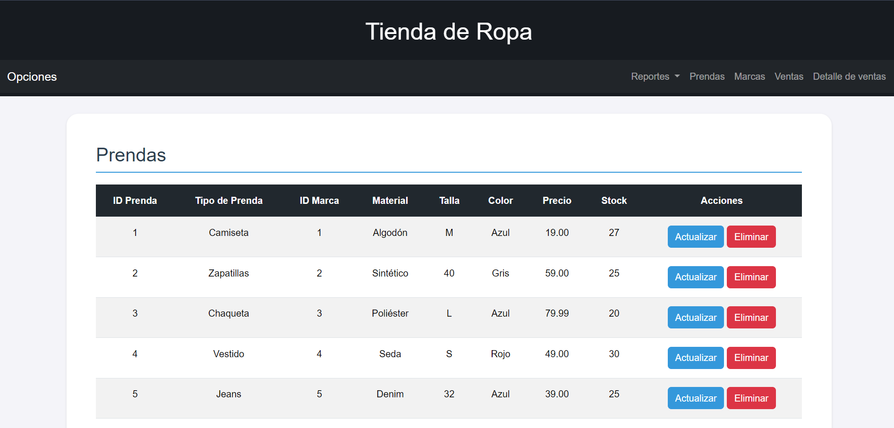

# <p style="color: rgb(93, 173, 226);"> Proyecto CRUD </p>

### Descripción

Este proyecto consiste en un CRUD de la base de datos que se puede ver a continuación en la imagen,
esta se conecta a traves de PHP para crear la API de la BD, ademas esta se encuentra organizada por modelos y
controladores los cuales están realizados igualmente en PHP y permiten manejar las 4 operaciones básicas del CRUD.

Ademas de esto la API esta conectada con el Frontend, a traves de JS para poder visualizar, agregar, actualizar y eliminar datos directamente en el HTML.

### Diagrama:


El tema/ámbito de la BD se enfoca en una tienda de ropa, con tablas como Ventas, Prendas, Marcas...
Por otro lado la tabla Tokens esta orientada a almacenar los tokens para poder acceder a la BD.

Resumen de tecnologias utilizadas:

- PHPMyAdmin
- PHP
- JS
- HTML
- CSS
- Bootstrap

### ¿Como usar? Y Endpoints

Es importante contar con XAMPP para ejecutar la web y poder acceder a la BD a traves de PHPMyAdmin.

Pasos:

1. Ejecutar script SQL `Tienda_ropa.sql`
2. Clonar repositorio en htdocs de XAMPP
3. Comprobar y ajustar datos del archivo en: API/src/db/Database.php
4. Ingresar al Frontend a traves de una URL similar a: `http://localhost/CRUD-JS-PHP/Frontend/index.html`

> [!NOTE]
> Antes de ingresar al Frontend activar lo siguiente:
>
> 

Al ingresar se debería mostrar esto:

A partir de aqui se puede acceder al CRUD y sus funciones.

---

#### Endpoint principal/base de la API:

`http://localhost/CRUD-JS-PHP/API/public/index.php/`

#### Tokens para ingresar y su fecha de vencimiento:

```
("d3b07384d113edec49eaa6238ad5ff00": "2024-12-10 12:00:00")

("6f1ed002ab5595859014ebf0951522d9": "2024-12-11 12:00:00")

("c4ca4238a0b923820dcc509a6f75849b": "2024-12-12 12:00:00")

("98f13708210194c475687be6106a3b84": "2024-12-13 12:00:00")

("3c59dc048e885024e6b0a1c72b1b6d1f":" 2024-12-14 12:00:00")

("aab3238922bcc25a6f606eb525ffdc56": "2024-12-15 12:00:00")

("7c222fb2927d828af22f592134e893a": "2024-12-16 12:00:00")

("16a7b23f2a6b9b27a94f374c96a9b70": "2024-12-17 12:00:00")

("2d2d1fe74f529f8bc7fbc946bde5cd7": "2026-12-18 12:00:00")

("0cc175b9c0f1b6a831c399e269772661": "2024-12-19 12:00:00")
```

---

### Endpoints para el modelo de cada tabla:

**(⚠️En cada Endpoint, sustituir NOMBRE-MODELO por: `prendas` ,`marcas`, `ventas` o `detalles_ventas`)**

1. Endpoint para obtener todos los datos según el modelo:

   - Método: GET
   - Descripción: Obtiene una lista de todos los datos disponibles en la tabla.

   ```http
   GET http://localhost/CRUD-JS-PHP/API/public/index.php/NOMBRE-MODELO
   ```

---

2. Endpoint para obtener un dato según el modelo y su ID:

   - Método: GET
   - Descripción: Obtiene la información específica usando un ID.

   ```http
   GET http://localhost/CRUD-JS-PHP/API/public/index.php/NOMBRE-MODELO?id=2
   ```

---

3. Endpoint para eliminar un dato según el modelo y su ID:

   - Método: DELETE
   - Descripción: Elimina un dato específico de la base de datos.

   ```http
   DELETE http://localhost/CRUD-JS-PHP/API/public/index.php/NOMBRE-MODELO?id=2
   ```

---

4. Endpoint para agregar un dato:

   - Método: POST
   - Descripción: Añade un dato a la base de datos.

   ```http
   POST http://localhost/CRUD-JS-PHP/API/public/index.php/NOMBRE-MODELO?id=3
   ```

   Cuerpo de la petición JSON:

   ```json
   //Para prendas
    {
        "ID_Marca": 5,
        "Tipo_de_prenda": "EJ",
        "Material": "Denim",
        "Talla": "32",
        "Color": "Azul",
        "Precio": "39.99",
        "Stock": 25
    }

   //Para marcas
    {
        "Nombre": "Nike",
        "Descripción": "Marca de calzado y ropa deportiva",
        "País_de_origen": "Alemania",
        "Categoría": "Deportiva",
        "Contacto": "info@adidas.com"
    }

   //Para ventas
    {
        "Fecha_venta": "2024-10-07 11:00:00",
        "Metodo_pago": "PayPal",
        "Total_venta": "79.99"
    }

   //Para detalle_venta
    {
        "ID_prenda": 3,
        "ID_venta": 3,
        "Cantidad": 12,
        "Subtotal": "138.99"
    }
   ```

---

5. Endpoint para actualizar un dato:

   - Método: PUT
   - Descripción: Actualiza un dato de la base de datos.

   ```http
   PUT http://localhost/CRUD-JS-PHP/API/public/index.php/NOMBRE-MODELO
   ```

   Cuerpo de la petición JSON:

   ```json
   //Para prendas
    {
        "ID_Marca": 5,
        "Tipo_de_prenda": "EJ",
        "Material": "Denim",
        "Talla": "32",
        "Color": "Azul",
        "Precio": "39.99",
        "Stock": 25
    }

   //Para marcas
    {
        "Nombre": "Nike",
        "Descripción": "Marca de calzado y ropa deportiva",
        "País_de_origen": "Alemania",
        "Categoría": "Deportiva",
        "Contacto": "info@adidas.com"
    }

   //Para ventas
    {
        "Fecha_venta": "2024-10-07 11:00:00",
        "Metodo_pago": "PayPal",
        "Total_venta": "79.99"
    }

   //Para detalle_venta
    {
        "ID_prenda": 3,
        "ID_venta": 3,
        "Cantidad": 12,
        "Subtotal": "138.99"
    }
   ```

---

### Endpoints para el modelo de cada vista/reporte:

1. Obtener vista del top 5 marcas más vendidas:

   - Método: GET
   - URL:

   ```http
   GET http://localhost/CRUD-JS-PHP/API/public/index.php/reportes/top_5_marcas
   ```

2. Obtener vista de las prendas vendidas y su stock:

   - Método: GET
   - URL:

   ```http
   GET http://localhost/CRUD-JS-PHP/API/public/index.php/reportes/prendas_vendidas
   ```

3. Obtener vista de marcas con ventas:
   - Método: GET
   - URL:
   ```http
   GET http://localhost/CRUD-JS-PHP/API/public/index.php/reportes/marcas_con_ventas
   ```
